Property Administration & Tenant Management System

A Java-based desktop application developed as my Information Technology Practical Assessment Task (PAT).

The system was designed to help manage properties, tenants, payments, expenses, and related administrative information through a graphical user interface backed by a Microsoft Access database.

📸 Screenshots

### Login

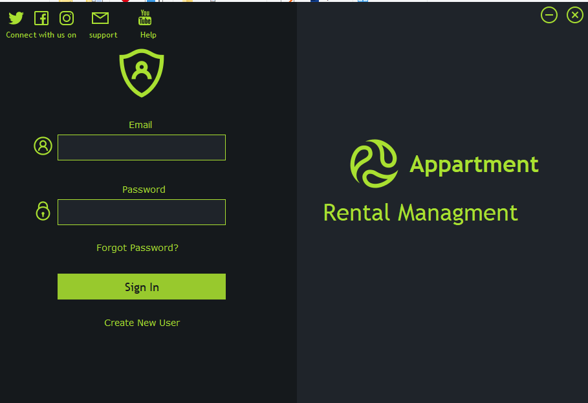

Secure login interface used to access the application.

### Main Menu

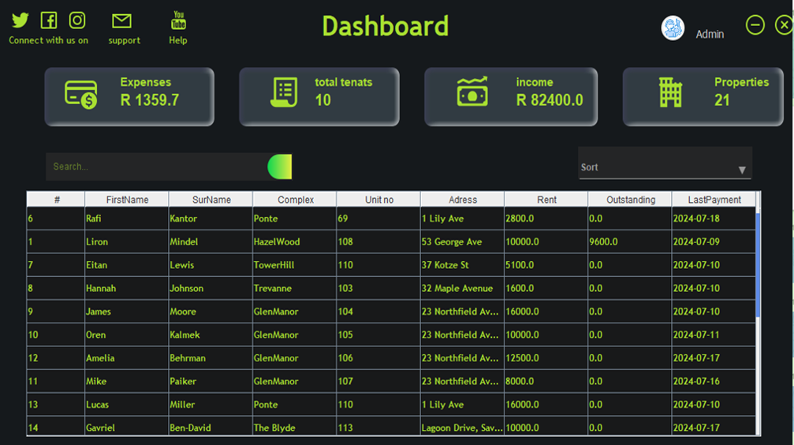

Central navigation screen providing access to the different areas of the system.

### Property Managment

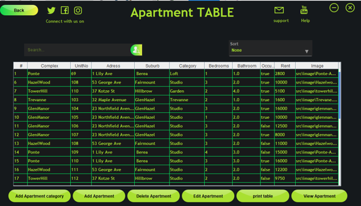
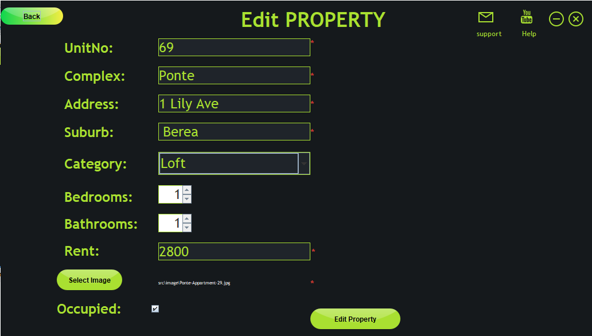
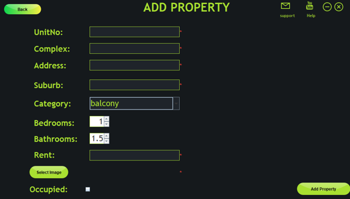

Manage property information and view existing properties stored in the database.

### Tenant Management

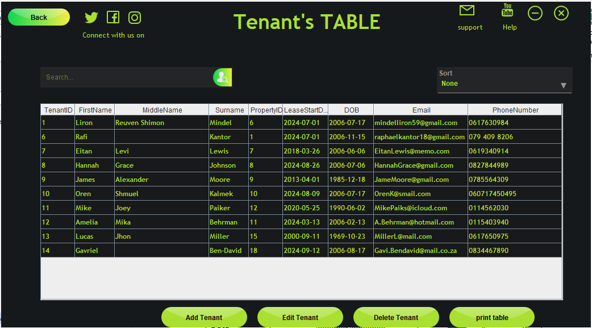
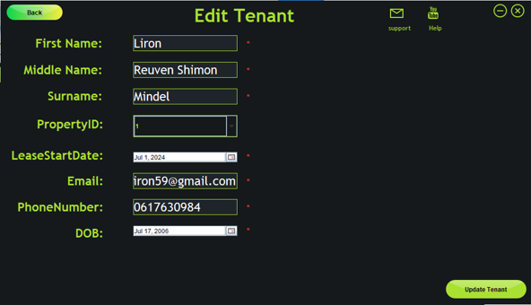
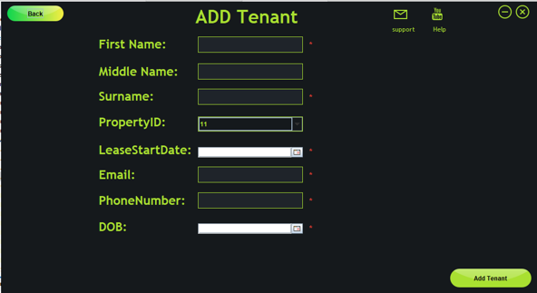

Manage tenant records and their associated property information.

### Payments

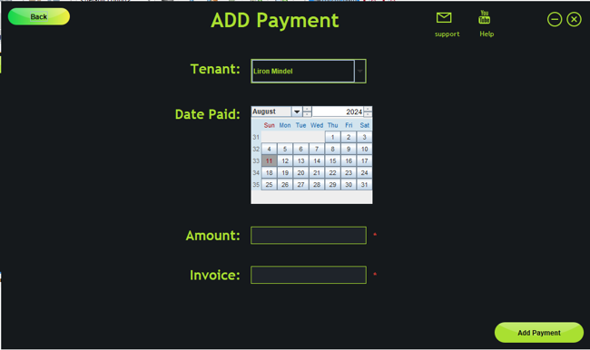

### Expenses

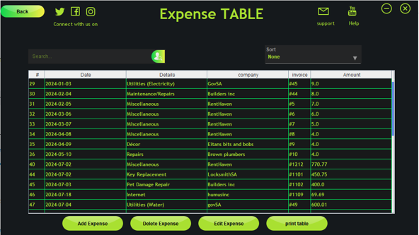
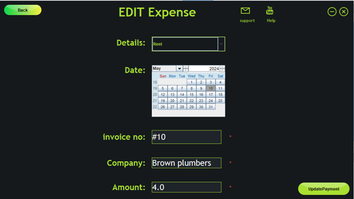
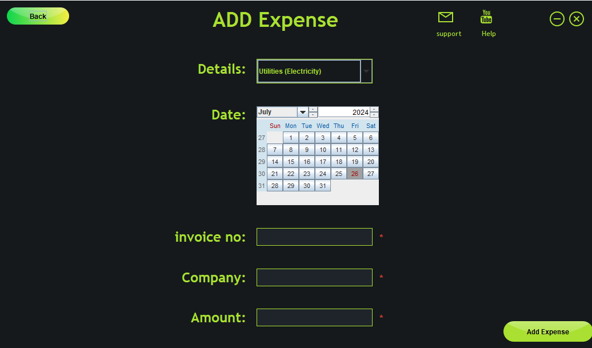

Record and manage payment information.

Note: Screenshots are provided to demonstrate the application's interface and functionality. The original PAT database has been replaced with a sanitised demonstration database.

🚀 Features
User authentication
Property management
Tenant management
Payment management
Expense management
Category management
Database integration
Search and filtering
Data validation
Graphical user interface
Reporting functionality
Persistent data storage

🛠️ Technologies
Technology	Purpose
Java	Application development
Java Swing	Graphical user interface
Microsoft Access	Database
UCanAccess	Java ↔ Access database connectivity
NetBeans	Development environment
JUnit	Testing

🏗️ Project Structure
Property-Administration-System/
│
├── database/
│   └── PATDB.accdb
│
├── src/
│   ├── app/
│   ├── classes/
│   ├── filter/
│   ├── swing/
│   └── view/
│
├── test/
│
├── nbproject/
│
├── screenshots/
│
├── README.md
├── SECURITY.md
└── .gitignore
Application Structure

The application separates different responsibilities into dedicated classes and packages.

View / GUI

Contains the Swing forms and user interface components.

Classes / Business Logic

Contains the application's core classes and operations for managing data.

Database

Handles communication between the Java application and Microsoft Access.

Filtering / Searching

Provides functionality for locating and filtering stored information.

Testing

Contains tests used during development to verify application functionality.

💾 Database

The application uses a Microsoft Access database through UCanAccess.

The original development database is not included in this repository.

Instead, this repository contains a sanitised demonstration database with fictional data.

Demo Login
Email:    demo@example.com
Password: demo123

The demonstration database is intended to allow the application structure and functionality to be explored without exposing the original PAT data.

🧪 Testing

Testing was performed throughout development to identify issues with:

User input
Database operations
Authentication
Searching and filtering
Data validation
Form navigation
Record creation and modification
Application behaviour under invalid input
📋 Key Development Concepts

This project gave me practical experience with:

Object-oriented programming
Java classes and objects
Encapsulation
Event-driven programming
GUI development
Database connectivity
CRUD operations
Input validation
Searching and filtering
Exception handling
Software testing
Project organisation
🎯 Project Purpose

The original project was developed as an IT PAT to demonstrate the design and implementation of a complete software solution to a real-world administrative problem.

The project involved moving from requirements and planning through to:

Requirements
     ↓
System Design
     ↓
Database Design
     ↓
GUI Development
     ↓
Implementation
     ↓
Testing
     ↓
Final Application
🔒 Portfolio & Copyright

This repository is published as part of my software development portfolio.

The source code is provided for portfolio and educational review purposes.

Copyright © 2026 Liron Mindel. All rights reserved.

The code may be viewed for evaluation purposes. Reproduction, redistribution, or incorporation into another project is not permitted without permission.

👨‍💻 About Me 

Computer Science student interested in software development, systems, electronics, and practical technology projects.

This project represents an earlier stage of my programming development and demonstrates my experience building a complete desktop application with Java and a relational database.
